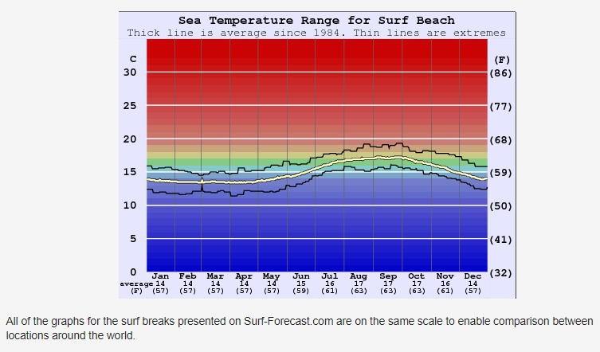
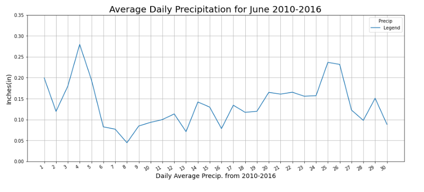
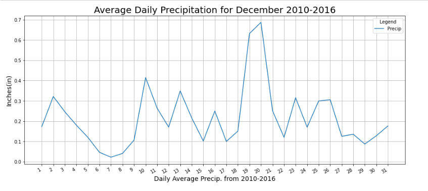

# Surfs_Up
## Overview of the Analysis
This analysis is inteded to be an accompaniment to a business plan for a 'Surf n' Shake' shop located on the island of Oahu, Hawaii. An investor has already voiced his willingness to sponsor the venture. However, the investor in question has made an attempt in the past to sponsor a surf shop much like this one. This previous venture could not seem to get a foothold in the market due to oversights related to the weather on the islands. To prevent this from happening to the new venture it is imperitive to analyze the amount of precipitation on Oahu to back up the business plan with factual evidence that Oahu is the best place to surf. Specifically, the investor wants temperature data for the months of June and December in Oahu to determine if the business is sustainable year-round. It is important to make this analysis repeatable in anticipation of future locations around the islands. 

## Results
### June/December Weather Comparison: Oahu
* June's average temperature is ~75&deg;F, four degrees warmer than December's average temperature of 71&deg;F. 
* June's lowest recorded temperature (64&deg;F) is closer to the average temperature than December's lowest recorded temperature (56&deg;F).
* June's lower and upper quartile begin at 73&deg;F & 77&deg;F, wheras Decembers lower and upper quartile begin at 69&deg;F and 74&deg;F respectively. 
* June has more weather data than December by 183 enteries, meaning June's data is approx. ~12% more accurate than December's data.

## Summary
The data collected does in fact give insight into the year-round sustainability of a surf and shake shop. The outlook for this shop through the year is a positive one. While there are days that could be considered colder than average, the lowest temp recorded in the December temp data on Oahu was a balmy 56&deg;F. While the 'Shake' side of the business may see a decline in customers, it is likely that the surf shop will still do well when considering surfing water temperatures. While there is no data present for water temperatures around Oahu, water temp data exists for another popular surfing location in the US, Santa Barbara, California. (See fig. 1)  
 
 
 
(Above: Fig. 1 Source: https://www.surf-forecast.com/breaks/Surf-Beach_1/seatemp)
This graph shows average water temps off the coast of Santa Barbara with data derived from an analysis of over three decades of oceanographic satellite measurements. This data shows the water temperatures in one of the most popular surfing locations in the US rarely reaches an average above 62&deg;F. It can be stated with the assistance of the extra data, that the coldest temperatures recorded in December on Oahu are still viable surfing temperature. 
 
### Precipitation Data 
The investor's previous endeavor into the surfing industry was 'Rained out of existence'. Therefore, it is of the utmost importance to convey the precipitation in the months of June and December to the investor. As a solution to the conveyance of precipitation data, a script has been written to capture the recorded daily precipitation on each day of the months of June and December. This data spans from 2010 to 2016, and returns multiple precipitation values for each day of the month throughout the years. This yearly data is then averaged by day of the months in question, and is graphed by this daily average. The following are the results for daily average precipitation from 2010-2016 for the months of June and December around Oahu. 
 

  
 
 
 
The data above shows elevated average rainfall in the month of December. When compared to June, the average daily rainfall for December is typically much higher with a higher variance between days of the month. June's precipitation data is much more linear and rarely reaches averages over .25 inches of precipitation daily. Decembers highest average rainfall occurs towards the latter third of the month, with average values over .625 inches of precipitation daily for December 19th and 20th. This rain data should be considered when thinking of a sustainable business plan to last through the rainy season on Oahu. The Surf and Shake shop should consider options to cut costs in and around the month of December. Possible solutions to circumvent being rained out range from a trimmed hourly schedule during this time, to focusing on creating an online sales presence to boost sales of surf equipment around the islands.